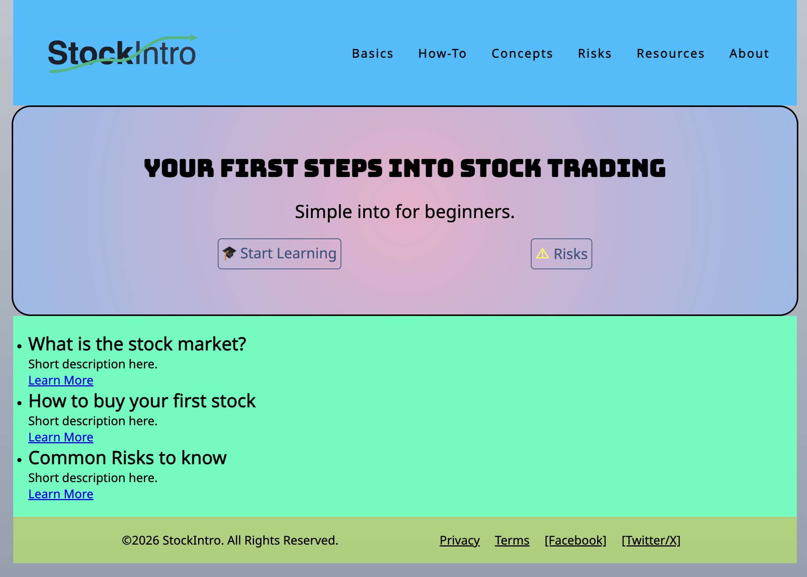
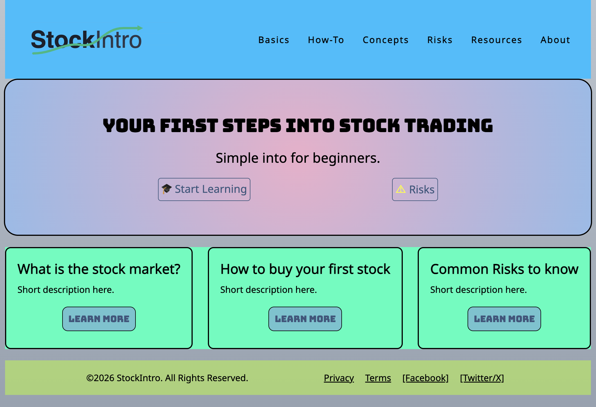
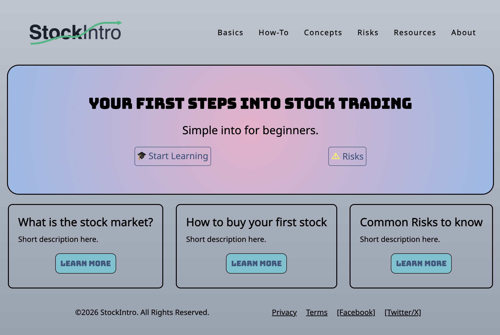

This is my project for Web Design.

Accessible at: https://jkjameson.github.io/web-design-course/

## Stage 1: Sketch of home page

- [x] Initial sketch

## Stage 2: Home page work

- [ ] Logo
- [x] Navigation
- [x] Hero Section
- [ ] Teaser Cards
- [ ] Footer

## Stage 3: Home page progression

- [x] Logo (Disclaimer: I used Google's Gemini Nano Banana AI to generate the SVG logo)
- [x] Navigation
- [x] Hero Section
- [ ] Teaser Cards
- [x] Footer

## Stage 4: Home page progression

- [x] Logo
- [x] Navigation
- [x] Hero Section
- [X] Teaser Cards
- [x] Footer

## Stage 5: Remove development colours

